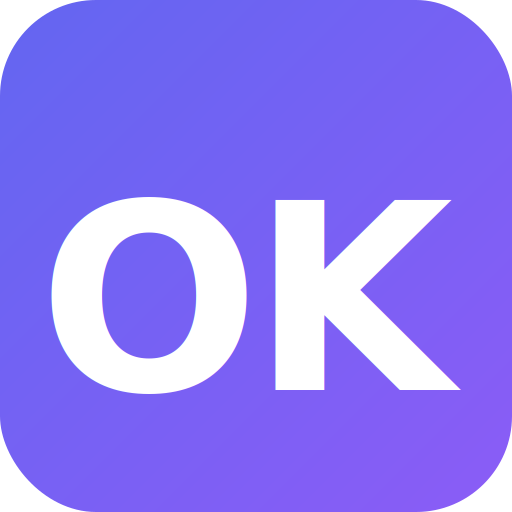

<p align="center">
  
</p>

<h1 align="center">OK</h1>

<p align="center">
  <b>Lightweight personal AI assistant framework in Go</b>
</p>

<p align="center">
  
  
  
  
</p>

---

## What is OK?

OK is a single-binary AI assistant that connects LLMs to your favorite messaging apps. It started as a fork of [PicoClaw/OpenClaw](https://github.com/claw-project/openclaw) with a focus on accessibility — an embedded web UI for zero-CLI configuration, built-in RAG for long-term memory, and MCP support for external tools.

- **Single binary** — one `go build`, no CGO, no runtime deps
- **Multi-provider** — OpenAI, Anthropic, Gemini, DeepSeek, Groq, Ollama, and [13+ vendors](#supported-vendors)
- **Multi-channel** — Telegram, Discord, WhatsApp, Slack
- **Web UI** — embedded config editor with i18n (EN/PT-BR/ES)
- **RAG** — semantic long-term memory via vector embeddings
- **MCP** — Model Context Protocol support (stdio + HTTP/SSE)
- **Skills** — extensible skill system + ClawHub registry
- **Agent architecture** — decomposed ReAct loop (Planner + ToolExecutor + MemoryManager)

## Features

### Multi-Provider LLM

Use any combination of providers. The `vendor/model` format auto-resolves the right protocol. Multiple entries with the same `model_name` are load-balanced.

| Vendor | Prefix | Protocol |
|--------|--------|----------|
| OpenAI | `openai/` | OpenAI |
| Anthropic | `anthropic/` | Anthropic |
| Google Gemini | `gemini/` | OpenAI |
| DeepSeek | `deepseek/` | OpenAI |
| Groq | `groq/` | OpenAI |
| Ollama | `ollama/` | OpenAI |
| OpenRouter | `openrouter/` | OpenAI |
| NVIDIA | `nvidia/` | OpenAI |
| Cerebras | `cerebras/` | OpenAI |
| Qwen | `qwen/` | OpenAI |
| Zhipu AI | `zhipu/` | OpenAI |
| LiteLLM | `litellm/` | OpenAI |
| vLLM | `vllm/` | OpenAI |

### Chat Channels

| Channel | Setup |
|---------|-------|
| **Telegram** | Easy — just a bot token |
| **Discord** | Easy — bot token + intents |
| **WhatsApp** | Easy — QR code scan |
| **Slack** | Medium — bot token + app token |

### Web UI

The embedded web UI starts alongside the gateway. Configure everything from your browser — models, agents, channels, tools, MCP servers, RAG, and more.

- Real-time log viewer
- Test chat interface
- Multi-language: English, Português, Español

### RAG (Retrieval-Augmented Generation)

Semantic long-term memory powered by vector embeddings. OK indexes conversations and retrieves relevant context automatically.

- Works with any OpenAI-compatible embeddings API (OpenAI, Ollama, vLLM)
- Flat-file storage — no external database required
- Configurable similarity threshold and result count

### MCP (Model Context Protocol)

Connect external tool servers via the Model Context Protocol. OK auto-discovers tools from MCP servers and makes them available to agents.

- Supports `stdio` and `HTTP/SSE` transports
- Test connections from the web UI

### Skills

Extend agents with skill packages — markdown-defined capabilities that add domain knowledge and tools.

- Load from workspace, global, or builtin directories
- Install from [ClawHub](https://clawhub.ai) registry
- Agents can search and install skills at runtime

### Security Sandbox

Agents run in a restricted workspace by default:

- File operations confined to `~/.ok/workspace/`
- Dangerous commands blocked (`rm -rf`, `format`, `dd`, fork bombs, etc.)
- Configurable via `restrict_to_workspace` flag

### Agent Architecture

The agent loop is decomposed into focused components:

- **Planner** — ReAct loop: LLM call → tool calls → observe → repeat
- **ToolExecutor** — parallel tool execution with async support
- **MemoryManager** — context loading, session persistence, emergency compression, RAG indexing

## Quick Start

```bash
# Clone and build
git clone https://github.com/renesul/ok.git
cd ok
make build
make install   # installs to ~/.local/bin

# Initialize workspace and config
ok onboard

# Test with a direct message
ok agent -m "Hello, what can you do?"

# Start the gateway (connects to chat apps + web UI)
ok gateway
```

## Configuration

Config file: `~/.ok/config.json`

### Environment Variables

| Variable | Description | Default |
|----------|-------------|---------|
| `OK_CONFIG` | Path to config file | `~/.ok/config.json` |
| `OK_HOME` | Root directory for OK data | `~/.ok` |

All config fields can be overridden with env vars using the `OK_` prefix:

```bash
OK_AGENTS_DEFAULTS_MODEL=claude-sonnet-4.6 ok gateway
OK_HOME=/srv/ok OK_CONFIG=/srv/ok/main.json ok gateway
```

### Minimal Config

```json
{
  "model_list": [
    {
      "model_name": "gpt-5.2",
      "model": "openai/gpt-5.2",
      "api_key": "sk-..."
    }
  ],
  "agents": {
    "defaults": {
      "model": "gpt-5.2"
    }
  },
  "channels": {
    "telegram": {
      "enabled": true,
      "token": "YOUR_BOT_TOKEN",
      "allow_from": ["YOUR_USER_ID"]
    }
  }
}
```

### Workspace Layout

```
~/.ok/workspace/
├── sessions/        # Conversation history
├── memory/          # Long-term memory (MEMORY.md)
├── state/           # Persistent state
├── cron/            # Scheduled jobs
├── skills/          # Custom skills
├── IDENTITY.md      # Agent identity
├── SOUL.md          # Agent personality
├── TOOLS.md         # Tool descriptions
├── HEARTBEAT.md     # Periodic task prompts
└── USER.md          # User preferences
```

### Supported Vendors

| Vendor | Prefix | Default API Base | Protocol |
|--------|--------|------------------|----------|
| OpenAI | `openai/` | `https://api.openai.com/v1` | OpenAI |
| Anthropic | `anthropic/` | `https://api.anthropic.com/v1` | Anthropic |
| Google Gemini | `gemini/` | `https://generativelanguage.googleapis.com/v1beta` | OpenAI |
| DeepSeek | `deepseek/` | `https://api.deepseek.com/v1` | OpenAI |
| Groq | `groq/` | `https://api.groq.com/openai/v1` | OpenAI |
| Qwen | `qwen/` | `https://dashscope.aliyuncs.com/compatible-mode/v1` | OpenAI |
| NVIDIA | `nvidia/` | `https://integrate.api.nvidia.com/v1` | OpenAI |
| Ollama | `ollama/` | `http://localhost:11434/v1` | OpenAI |
| OpenRouter | `openrouter/` | `https://openrouter.ai/api/v1` | OpenAI |
| Zhipu AI | `zhipu/` | `https://open.bigmodel.cn/api/paas/v4` | OpenAI |
| Cerebras | `cerebras/` | `https://api.cerebras.ai/v1` | OpenAI |
| LiteLLM | `litellm/` | `http://localhost:4000/v1` | OpenAI |
| vLLM | `vllm/` | `http://localhost:8000/v1` | OpenAI |

### Load Balancing

Multiple entries with the same `model_name` are automatically round-robined:

```json
{
  "model_list": [
    { "model_name": "gpt", "model": "openai/gpt-5.2", "api_key": "sk-key1", "api_base": "https://api1.example.com/v1" },
    { "model_name": "gpt", "model": "openai/gpt-5.2", "api_key": "sk-key2", "api_base": "https://api2.example.com/v1" }
  ]
}
```

### Web Search

```json
{
  "tools": {
    "web": {
      "duckduckgo": { "enabled": true, "max_results": 5 },
      "brave":      { "enabled": false, "api_key": "", "max_results": 5 },
      "perplexity": { "enabled": false, "api_key": "", "max_results": 5 },
      "searxng":    { "enabled": false, "base_url": "http://localhost:8888", "max_results": 5 }
    }
  }
}
```

Priority: Perplexity > Brave > SearXNG > DuckDuckGo (default, no key needed).

### Heartbeat (Periodic Tasks)

Create `~/.ok/workspace/HEARTBEAT.md` with tasks the agent runs every 30 minutes:

```markdown
- Check my email for important messages
- Review my calendar for upcoming events
```

```json
{ "heartbeat": { "enabled": true, "interval": 30 } }
```

## Web UI

Start the gateway and the web UI runs alongside it:

```bash
ok gateway
```

The web UI is accessible at the configured port (default: `http://localhost:18800`). From there you can manage:

- **Models** — add/remove LLM providers and configure model list
- **Auth** — OAuth flows for supported providers
- **Agents** — configure agent defaults, workspace, model selection
- **Bindings** — map agents to channels, groups, users
- **Channels** — Telegram, Discord, WhatsApp, Slack setup
- **MCP Servers** — add/test Model Context Protocol servers
- **Tools** — enable/disable tools, configure web search
- **RAG** — enable semantic memory, configure embeddings
- **Session** — summarization thresholds
- **Logs** — real-time gateway log viewer
- **Chat** — test conversations directly in the browser

Enable in config:
```json
{ "web_ui": { "enabled": true, "host": "127.0.0.1", "port": 18800 } }
```

## OK vs OpenClaw

An honest comparison with the upstream project.

### Where OK shines

- **Web UI** — embedded config editor, no CLI required for setup
- **RAG** — built-in semantic long-term memory with vector embeddings
- **MCP** — native Model Context Protocol support for external tools
- **Decomposed agent loop** — Planner/ToolExecutor/MemoryManager split for maintainability
- **i18n** — web interface in English, Portuguese, Spanish
- **Simple build** — single binary, zero CGO, linux only
- **Migration** — automatic config migration from OpenClaw

### Where OpenClaw is ahead

- **More channels** — IRC, Matrix, WeChat, Line, Feishu, QQ, DingTalk, and more
- **Larger community** — more contributors, more battle-tested
- **More documentation** — extensive docs in multiple languages
- **More platforms** — Windows, macOS support
- **CI/CD** — GoReleaser pipeline, automated releases
- **Production maturity** — deployed at larger scale

## CLI Reference

| Command | Description |
|---------|-------------|
| `ok onboard` | Initialize config and workspace |
| `ok agent -m "..."` | Send a message to the agent |
| `ok agent` | Interactive chat mode |
| `ok gateway` | Start gateway (chat apps + web UI) |
| `ok status` | Show agent and gateway status |
| `ok cron list` | List scheduled jobs |
| `ok cron add` | Add a scheduled job |
| `ok cron enable/disable` | Toggle scheduled jobs |
| `ok skills list` | List installed skills |
| `ok skills search` | Search ClawHub registry |
| `ok skills install` | Install a skill |
| `ok migrate openclaw` | Migrate from OpenClaw config |
| `ok version` | Show version info |

## Docker

```bash
# Build
docker build -t ok .

# Run
docker run -d \
  --name ok \
  -v ~/.ok:/home/ok/.ok \
  -p 18790:18790 \
  -p 18800:18800 \
  ok
```

Or with docker-compose:

```yaml
services:
  ok:
    build: .
    volumes:
      - ~/.ok:/home/ok/.ok
    ports:
      - "18790:18790"
      - "18800:18800"
    restart: unless-stopped
```

## Migration from OpenClaw

OK can automatically migrate your OpenClaw configuration:

```bash
ok migrate openclaw
```

This reads your existing OpenClaw config and creates an equivalent `~/.ok/config.json`.

## Credits

OK is a fork of [PicoClaw](https://github.com/pico-claw/picoclaw), itself based on [OpenClaw](https://github.com/claw-project/openclaw). Many thanks to the OpenClaw community for building the foundation this project stands on.

## License

[MIT](LICENSE)
